TRƯỜNG ĐẠI HỌC  CÔNG NGHỆ TP HCM
KHOA CÔNG NGHỆ THÔNG TIN
Môn: An toàn web và cơ sở dữ liệu

---------------------------------------------------------------------
BÁO CÁO TUẦN 01
Họ Và Tên: Hồ Đắc Hiệp 				            
MSSV: 2380600634
Lớp: 23DATA1

PHẦN BÀI LÀM
# 🔒 SecureValidator Lab — Báo Cáo Phân Tích Lỗ Hổng Bảo Mật

## 📋 Mục lục

- [Giới thiệu](#giới-thiệu)
- [Tổng quan lỗ hổng](#tổng-quan-lỗ-hổng)
- [1. Email Validation](#1-email-validation---regex-quá-lỏng-lẻo)
- [2. URL Validation](#2-url-validation---không-chặn-ssrf)
- [3. Filename Validation](#3-filename-validation---thiếu-kiểm-tra-an-toàn)
- [4. SQL Input Sanitization](#4-sql-input-sanitization---blacklist-regex-quá-yếu)
- [5. HTML Input Sanitization](#5-html-input-sanitization---htmlescape-chưa-đủ)
- [Kết luận](#kết-luận)

---

## Giới thiệu

Dự án **SecureValidator** cung cấp các hàm kiểm tra và lọc đầu vào (input validation & sanitization) bao gồm: email, URL, filename, SQL input và HTML input. Qua quá trình phân tích mã nguồn trong file `securevalidator/core.py` và viết test tấn công trong `tests/test_validators.py`, chúng tôi đã phát hiện **21 lỗ hổng bảo mật** được phân loại theo 5 nhóm chức năng.

---

## Tổng quan lỗ hổng

| STT | Hàm | Số lỗ hổng | Mức độ |
|-----|------|-----------|--------|
| 1 | `validate_email()` | 3 | 🟡 Trung bình |
| 2 | `validate_url()` | 4 | 🔴 Nghiêm trọng |
| 3 | `validate_filename()` | 3 | 🔴 Nghiêm trọng |
| 4 | `sanitize_sql_input()` | 9 | 🔴 Rất nghiêm trọng |
| 5 | `sanitize_html_input()` | 2 | 🟡 Trung bình |

---

## 1. Email Validation — Regex quá lỏng lẻo

### Mã nguồn hiện tại

```python
def validate_email(email: str) -> bool:
    pattern = r'^[\w\.-]+@[\w\.-]+\.\w+$'
    return re.fullmatch(pattern, email) is not None
```

### Lỗ hổng phát hiện

#### 1a. Cho phép `..` trong domain

- **Payload:** `user@exam..ple.com`
- **Kết quả:** `True` (chấp nhận email không hợp lệ)
- **Nguyên nhân:** Pattern `[\w\.-]+` match được chuỗi chứa `..` liên tiếp
- **Test:** `test_vuln_email_dot_dot_domain`

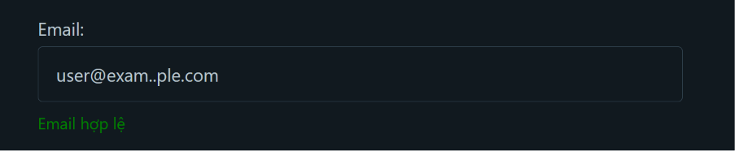

#### 1b. Cho phép email bắt đầu bằng dấu chấm

- **Payload:** `.user@example.com`
- **Kết quả:** `True` (chấp nhận email không hợp lệ)
- **Nguyên nhân:** Pattern `[\w\.-]+` match được `.user` — bắt đầu bằng dấu chấm
- **Test:** `test_vuln_email_leading_dot`

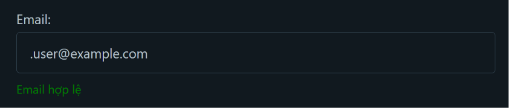

#### 1c. Cho phép TLD chỉ 1 ký tự

- **Payload:** `user@example.c`
- **Kết quả:** `True` (chấp nhận email không hợp lệ)
- **Nguyên nhân:** Pattern `\w+$` chỉ yêu cầu ≥1 ký tự, trong khi TLD hợp lệ phải ≥2
- **Test:** `test_vuln_email_single_char_tld`

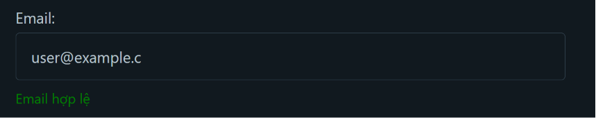

### ✅ Giải pháp khắc phục

```python
import re

def validate_email(email: str) -> bool:
    """Validate email format theo RFC 5322 (đơn giản hóa)."""
    # - Không cho phép bắt đầu/kết thúc bằng dấu chấm
    # - Không cho phép '..' liên tiếp
    # - TLD phải >= 2 ký tự
    pattern = r'^[a-zA-Z0-9]([a-zA-Z0-9._-]*[a-zA-Z0-9])?@[a-zA-Z0-9]([a-zA-Z0-9.-]*[a-zA-Z0-9])?\.[a-zA-Z]{2,}$'
    if re.fullmatch(pattern, email) is None:
        return False
    # Kiểm tra thêm: không cho phép '..' trong bất kỳ phần nào
    if '..' in email:
        return False
    return True
```

**Hoặc tốt hơn**, sử dụng thư viện chuyên dụng:

```python
# pip install email-validator
from email_validator import validate_email as ev, EmailNotValidError

def validate_email(email: str) -> bool:
    try:
        ev(email, check_deliverability=False)
        return True
    except EmailNotValidError:
        return False
```

---

## 2. URL Validation — Không chặn SSRF

### Mã nguồn hiện tại

```python
def validate_url(url: str) -> bool:
    try:
        parsed = urllib.parse.urlparse(url)
        return parsed.scheme in ['http', 'https'] and bool(parsed.netloc)
    except Exception:
        return False
```

### Lỗ hổng phát hiện

#### 2a. SSRF — Cho phép truy cập `localhost`

- **Payload:** `http://localhost`
- **Kết quả:** `True` → Attacker truy cập được service nội bộ
- **Test:** `test_vuln_url_ssrf_localhost`

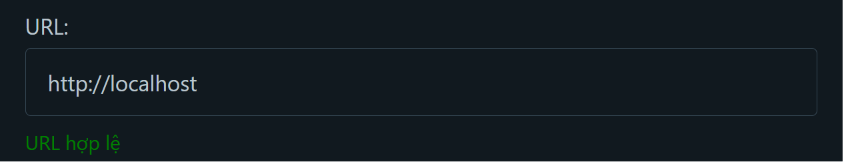

#### 2b. SSRF — Cho phép truy cập `127.0.0.1`

- **Payload:** `http://127.0.0.1:8080`
- **Kết quả:** `True` → Attacker scan port nội bộ
- **Test:** `test_vuln_url_ssrf_internal_ip`

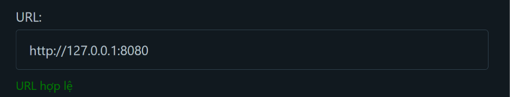

#### 2c. SSRF — Cho phép truy cập dải IP private

- **Payload:** `http://192.168.1.1`
- **Kết quả:** `True` → Attacker truy cập mạng nội bộ
- **Test:** `test_vuln_url_ssrf_private_network`

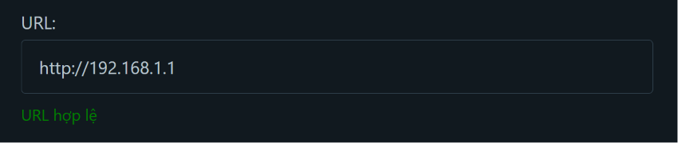

#### 2d. SSRF — Cho phép truy cập cloud metadata

- **Payload:** `http://169.254.169.254/latest/meta-data/`
- **Kết quả:** `True` → Lộ credentials AWS/GCP/Azure
- **Mức độ:** 🔴 Rất nghiêm trọng — có thể dẫn đến chiếm quyền toàn bộ hạ tầng cloud
- **Test:** `test_vuln_url_ssrf_cloud_metadata`

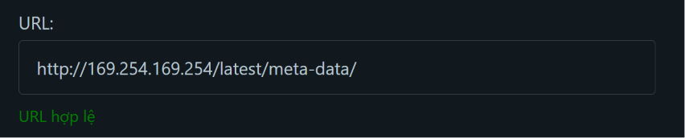

### ✅ Giải pháp khắc phục

```python
import urllib.parse
import ipaddress
import socket

# Danh sách hostname bị cấm
BLOCKED_HOSTNAMES = {'localhost', 'localhost.localdomain', '0.0.0.0', '[::1]'}

def _is_private_ip(hostname: str) -> bool:
    """Kiểm tra IP có thuộc dải private/reserved không."""
    try:
        # Resolve hostname thành IP
        ip_str = socket.gethostbyname(hostname)
        ip = ipaddress.ip_address(ip_str)
        return (
            ip.is_private or
            ip.is_loopback or
            ip.is_reserved or
            ip.is_link_local  # 169.254.x.x — cloud metadata
        )
    except (socket.gaierror, ValueError):
        return True  # Không resolve được → block luôn cho an toàn

def validate_url(url: str) -> bool:
    """Validate URL và chặn SSRF vectors."""
    try:
        parsed = urllib.parse.urlparse(url)

        # Chỉ cho phép http/https
        if parsed.scheme not in ['http', 'https']:
            return False

        # Phải có netloc (hostname)
        if not parsed.netloc:
            return False

        # Lấy hostname (bỏ port nếu có)
        hostname = parsed.hostname
        if not hostname:
            return False

        # Chặn hostname cấm
        if hostname.lower() in BLOCKED_HOSTNAMES:
            return False

        # Chặn IP private/reserved/loopback/link-local
        if _is_private_ip(hostname):
            return False

        return True
    except Exception:
        return False
```

---

## 3. Filename Validation — Thiếu kiểm tra an toàn

### Mã nguồn hiện tại

```python
def validate_filename(filename: str) -> bool:
    if ".." in filename or "/" in filename or "\\" in filename:
        return False
    return os.path.basename(filename) == filename
```

### Lỗ hổng phát hiện

#### 3a. Null byte injection

- **Payload:** `malware.php\x00.pdf`
- **Kết quả:** `True` — Không chứa `..`, `/`, `\\` nên pass
- **Nguy hiểm:** Trên hệ thống C-based, null byte `\x00` cắt chuỗi → file thực tế là `malware.php`
- **Test:** `test_vuln_filename_null_byte`

#### 3b. Không kiểm tra whitelist extension

- **Payload:** `shell.exe`, `backdoor.sh`, `hack.bat`, `webshell.php`, `cmd.ps1`
- **Kết quả:** Tất cả đều `True`
- **Nguy hiểm:** Cho phép upload file thực thi → Remote Code Execution (RCE)
- **Test:** `test_vuln_filename_dangerous_extension`

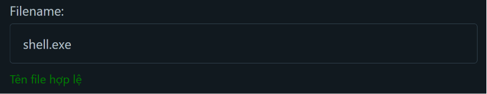

#### 3c. Filename `.` (current directory)

- **Payload:** `.`
- **Kết quả:** `True` — `os.path.basename('.')` trả về `.`
- **Test:** `test_vuln_filename_dot_only`

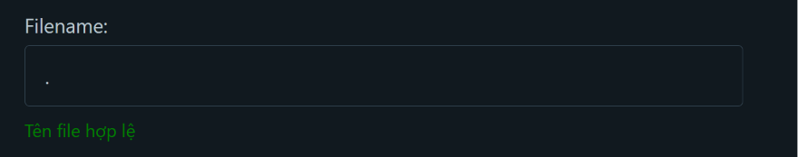

### ✅ Giải pháp khắc phục

```python
import os
import re

# Whitelist extension an toàn
ALLOWED_EXTENSIONS = {'.pdf', '.jpg', '.jpeg', '.png', '.gif', '.txt', '.csv', '.docx', '.xlsx'}

def validate_filename(filename: str) -> bool:
    """Kiểm tra tên file an toàn."""
    # 1. Chặn null byte
    if '\x00' in filename or '\0' in filename:
        return False

    # 2. Chặn path traversal
    if '..' in filename or '/' in filename or '\\' in filename:
        return False

    # 3. Chặn filename rỗng hoặc chỉ là dấu chấm
    if not filename or filename in ('.', '..'):
        return False

    # 4. Chỉ cho phép ký tự an toàn (alphanumeric, dấu gạch, dấu chấm)
    if not re.match(r'^[a-zA-Z0-9][a-zA-Z0-9_.-]*$', filename):
        return False

    # 5. Kiểm tra basename (phòng thủ sâu)
    if os.path.basename(filename) != filename:
        return False

    # 6. Whitelist extension
    _, ext = os.path.splitext(filename)
    if ext.lower() not in ALLOWED_EXTENSIONS:
        return False

    return True
```

---

## 4. SQL Input Sanitization — Blacklist regex quá yếu

### Mã nguồn hiện tại

```python
def sanitize_sql_input(input_str: str) -> str:
    sanitized = re.sub(r"(--|;|'|\"|#)", "", input_str)
    sanitized = re.sub(r"\b(OR|AND|SELECT|INSERT|DELETE|UPDATE|DROP|UNION|WHERE)\b",
                       "", sanitized, flags=re.IGNORECASE)
    return sanitized.strip()
```

> ⚠️ **Đây là nhóm lỗ hổng nghiêm trọng nhất.** Phương pháp blacklist-based sanitization về bản chất **không thể an toàn** vì luôn có cách bypass.

### Lỗ hổng phát hiện

#### 4a. Bypass bằng toán tử `||`

- **Payload:** `1 || 1=1`
- **Kết quả:** Giữ nguyên — `||` tương đương `OR` trong PostgreSQL, SQLite
- **Test:** `test_vuln_sql_bypass_pipe_operator`

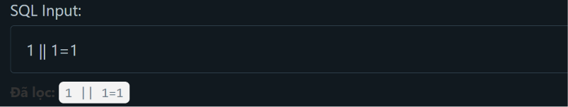

#### 4b. Bypass bằng block comment `/* */`

- **Payload:** `admin/* bypass comment */`
- **Kết quả:** `/*` không bị lọc — chỉ lọc `--` và `#`
- **Test:** `test_vuln_sql_bypass_block_comment`

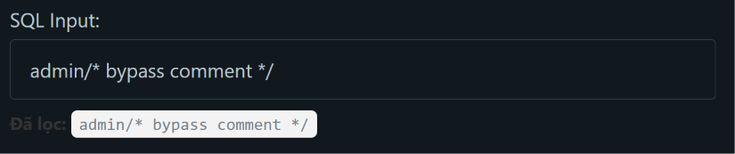

#### 4c. Bypass bằng nested keyword

- **Payload:** `SELSELECTECT * FROM users`
- **Kết quả:** Sau khi lọc `SELECT` ở giữa → còn lại `SELECT * FROM users`!
- **Nguy hiểm:** Kỹ thuật cổ điển bypass bộ lọc từ khóa
- **Test:** `test_vuln_sql_bypass_case_obfuscation`

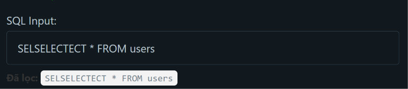

#### 4d. Bypass bằng `EXEC`

- **Payload:** `EXEC sp_executesql N'SELECT * FROM users'`
- **Kết quả:** `EXEC` không nằm trong blacklist → thực thi stored procedure
- **Test:** `test_vuln_sql_bypass_exec`

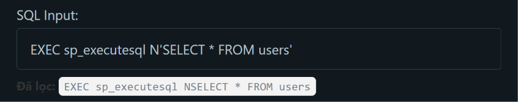

#### 4e. Bypass bằng `HAVING`

- **Payload:** `1 HAVING 1=1`
- **Kết quả:** `HAVING` không bị lọc → error-based SQL injection
- **Test:** `test_vuln_sql_bypass_having`

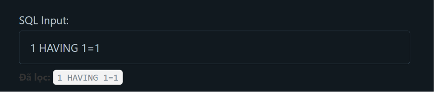

#### 4f. Bypass bằng `WAITFOR DELAY` (time-based blind SQLi)

- **Payload:** `1; WAITFOR DELAY '0:0:5'`
- **Kết quả:** `WAITFOR` không bị lọc → đo thời gian phản hồi để trích xuất dữ liệu
- **Test:** `test_vuln_sql_bypass_waitfor`

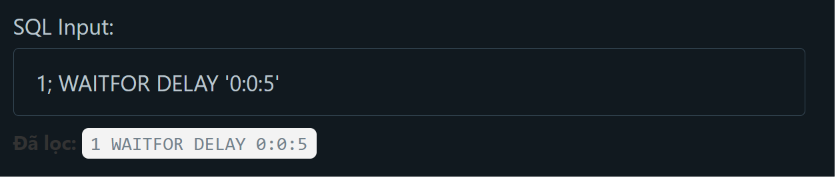

#### 4g. Bypass bằng `BENCHMARK()` (MySQL time-based)

- **Payload:** `1 BENCHMARK(10000000,SHA1('test'))`
- **Kết quả:** `BENCHMARK` không bị lọc → MySQL time-based blind injection
- **Test:** `test_vuln_sql_bypass_benchmark`

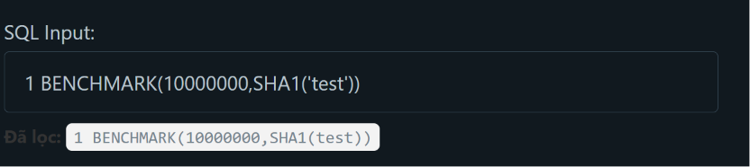

#### 4h. Bypass bằng hex encoding

- **Payload:** `0x61646D696E` (= `admin` dạng hex)
- **Kết quả:** Hex không bị lọc → bypass bộ lọc quote/chuỗi
- **Test:** `test_vuln_sql_bypass_hex_encoding`

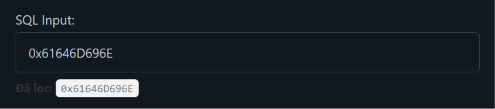

#### 4i. Bypass bằng `CHAR()` function

- **Payload:** `CHAR(39)` (= dấu nháy đơn `'`)
- **Kết quả:** `CHAR()` không bị lọc → tạo ký tự bất kỳ trong SQL
- **Test:** `test_vuln_sql_bypass_char_function`

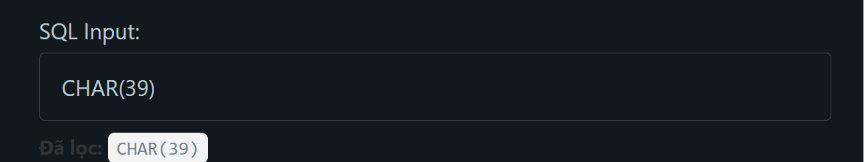

### ✅ Giải pháp khắc phục

> 🔴 **KHÔNG BAO GIỜ sử dụng blacklist/regex để chống SQL Injection!**
> Giải pháp duy nhất đúng đắn là **Parameterized Queries (Prepared Statements).**

```python
# ❌ SAI — Blacklist-based sanitization (luôn có thể bypass)
def bad_query(user_input):
    sanitized = sanitize_sql_input(user_input)
    query = f"SELECT * FROM users WHERE name = '{sanitized}'"
    cursor.execute(query)

# ✅ ĐÚNG — Parameterized Query (không thể SQL injection)
def good_query(user_input):
    query = "SELECT * FROM users WHERE name = %s"
    cursor.execute(query, (user_input,))
```

**Ví dụ với các framework phổ biến:**

```python
# SQLAlchemy ORM (Python)
user = session.query(User).filter(User.name == user_input).first()

# SQLAlchemy Core
stmt = select(users).where(users.c.name == user_input)
result = connection.execute(stmt)

# Flask-SQLAlchemy
user = User.query.filter_by(name=user_input).first()

# Django ORM
user = User.objects.filter(name=user_input).first()

# SQLite3 (Python built-in)
cursor.execute("SELECT * FROM users WHERE name = ?", (user_input,))
```

Nếu vẫn cần hàm sanitize cho các trường hợp đặc biệt (ví dụ: tên cột động), hãy sử dụng **whitelist** thay vì blacklist:

```python
ALLOWED_COLUMNS = {'name', 'email', 'age', 'created_at'}

def safe_dynamic_column(column_name: str) -> str:
    """Cho phép tên cột động nhưng chỉ từ whitelist."""
    if column_name not in ALLOWED_COLUMNS:
        raise ValueError(f"Cột không hợp lệ: {column_name}")
    return column_name
```

---

## 5. HTML Input Sanitization — `html.escape()` chưa đủ

### Mã nguồn hiện tại

```python
def sanitize_html_input(html_str: str) -> str:
    return html.escape(html_str)
```

### Lỗ hổng phát hiện

#### 5a. Không chặn `javascript:` URI scheme

- **Payload:** `javascript:alert(1)`
- **Kết quả:** Giữ nguyên — không có ký tự HTML đặc biệt nào cần escape
- **Nguy hiểm:** Nếu output nằm trong attribute `href`: `<a href="javascript:alert(1)">` → XSS
- **Test:** `test_vuln_html_javascript_uri_scheme`

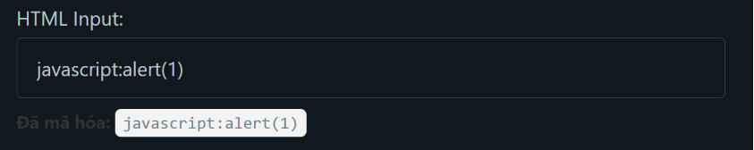

#### 5b. Thiếu Content-Security-Policy (CSP) header

- **Vấn đề:** Ứng dụng không gửi kèm header bảo mật CSP. Đây là lỗ hổng về mặt cấu hình (thiếu lớp phòng thủ chiều sâu), không phải là lỗi do người dùng nhập vào nên **không có payload trực tiếp**.
- **Nguy hiểm:** Nếu lập trình viên có **bất kỳ chỗ nào** quên gọi hàm `escape` (hoặc bypass được như ở mục 5a), đoạn mã độc XSS sẽ được trình duyệt thực thi ngay lập tức vì không có CSP ngăn chặn.
- **Test:** `test_vuln_html_no_csp_protection`

### ✅ Giải pháp khắc phục

```python
import html
import re

def sanitize_html_input(html_str: str) -> str:
    """Escape HTML input và chặn URI scheme nguy hiểm."""
    # 1. Escape ký tự HTML đặc biệt
    sanitized = html.escape(html_str, quote=True)

    # 2. Chặn javascript: và data: URI scheme (case-insensitive)
    sanitized = re.sub(
        r'(?i)(javascript|data|vbscript)\s*:',
        '[blocked]:', sanitized
    )

    return sanitized
```

**Thêm CSP header trong Flask:**

```python
from flask import Flask, make_response

app = Flask(__name__)

@app.after_request
def add_security_headers(response):
    # Content Security Policy — chặn inline script
    response.headers['Content-Security-Policy'] = (
        "default-src 'self'; "
        "script-src 'self'; "            # Chỉ cho phép script từ cùng origin
        "style-src 'self' 'unsafe-inline'; "
        "img-src 'self' data:; "
        "frame-ancestors 'none'; "        # Chống clickjacking
    )
    # Các header bảo mật khác
    response.headers['X-Content-Type-Options'] = 'nosniff'
    response.headers['X-Frame-Options'] = 'DENY'
    response.headers['X-XSS-Protection'] = '1; mode=block'
    response.headers['Referrer-Policy'] = 'strict-origin-when-cross-origin'
    return response
```

---

## Kết luận

### Nguyên tắc bảo mật cần tuân thủ

| Nguyên tắc | Giải thích |
|-----------|-----------|
| **Defense in Depth** | Không bao giờ chỉ dựa vào 1 lớp bảo vệ. Kết hợp validation + sanitization + CSP + WAF |
| **Whitelist > Blacklist** | Luôn ưu tiên cho phép những gì hợp lệ, thay vì chặn những gì nguy hiểm |
| **Parameterized Queries** | Giải pháp **duy nhất đúng** cho SQL Injection. Không bao giờ nối chuỗi SQL |
| **Context-aware Escaping** | Escape phải phù hợp với ngữ cảnh (HTML body, attribute, JavaScript, URL, CSS) |
| **Principle of Least Privilege** | Chỉ cho phép những gì cần thiết (extension, hostname, scheme...) |

### Kết quả test

```
Ran 31 tests in 0.001s — OK

✅ 10 test chức năng cơ bản (pass — xác nhận hành vi hiện tại)
✅ 21 test phát hiện lỗ hổng (pass — chứng minh lỗ hổng tồn tại)
```

> **Lưu ý:** Tất cả test lỗ hổng (`test_vuln_*`) đều pass, nghĩa là các lỗ hổng **thực sự tồn tại** trong code hiện tại. Các test này được thiết kế để "pass khi lỗ hổng còn tồn tại" — khi đã sửa code thì test sẽ fail (cần cập nhật test theo logic mới).
