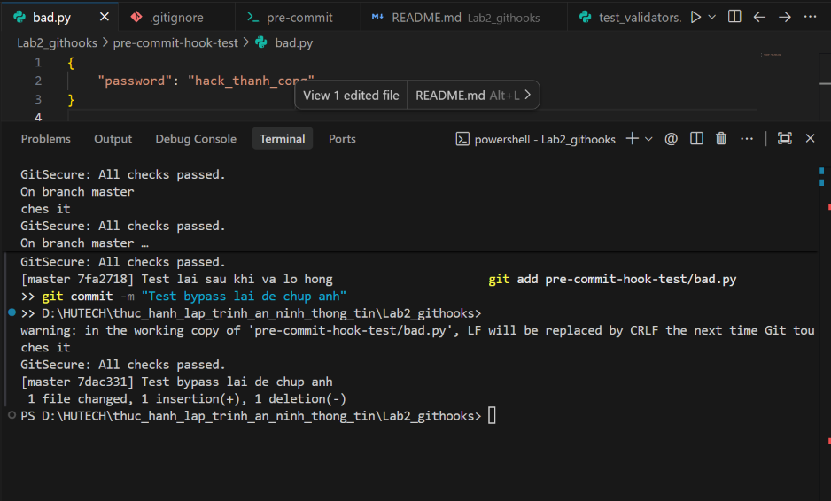
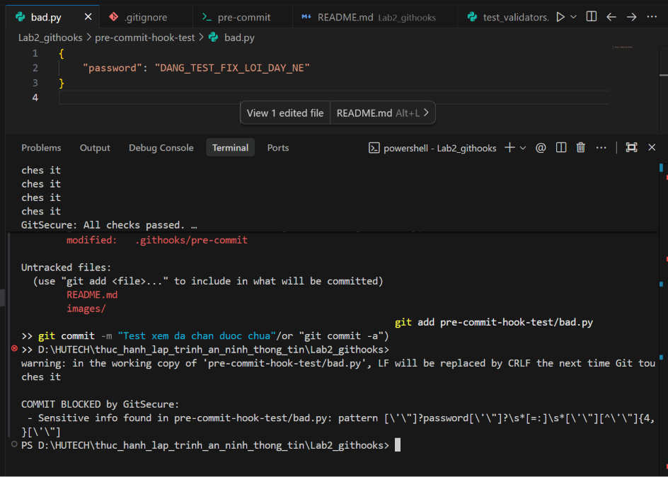

# Báo cáo Thực hành: Kỹ thuật Bypass Git Hooks và Cách Khắc phục

Bài báo cáo này trình bày chi tiết 2 trường hợp vượt qua (bypass) kịch bản kiểm tra bảo mật `pre-commit` bằng Regex cơ bản, đồng thời đưa ra giải pháp vá lỗi (fix) cho từng trường hợp kèm theo minh chứng thực nghiệm.

---

## 1. Trường hợp 1: Bypass bằng định dạng JSON / Dictionary

Kịch bản bảo mật ban đầu sử dụng Regex bắt buộc phải có dấu bằng (`=`) giữa tên biến và giá trị.
**Regex cũ:** `r"password\s*=\s*[\'\"][^\'\"]{4,}[\'\"]"`

Trong thực tế, lập trình viên thường lưu thông tin cấu hình dưới dạng JSON hoặc Dictionary (sử dụng dấu hai chấm `:`). Kẻ tấn công hoặc lập trình viên bất cẩn có thể lọt qua bẫy này.

### 1.1. Thực hiện Bypass
Tiến hành khai báo mật khẩu trong file `bad.py` bằng cấu trúc JSON:
```json
{
    "password": "my_secret_password"
}
```
Khi thực hiện lệnh `git commit`, hệ thống bảo mật không nhận diện được dấu hai chấm `:` và cho phép lọt qua.

**Minh chứng Bypass thành công:**


### 1.2. Khắc phục (Fix Lỗi)
Cập nhật lại kịch bản trong file `.githooks/pre-commit` để nhận diện cả dấu `:` và ngoặc kép `""` bọc quanh tên biến trong JSON.

**Regex mới:**
```python
r"[\'\"]?password[\'\"]?\s*[=:]\s*[\'\"][^\'\"]{4,}[\'\"]"
```

### 1.3. Kết quả sau khi Fix
Sau khi cập nhật Regex và tiến hành commit lại nội dung tương tự, kịch bản đã nhận diện chính xác và chặn đứng quá trình commit.

**Minh chứng vá lỗi thành công (Bị chặn bởi GitSecure):**


---

## 2. Trường hợp 2: Bypass bằng cách thay đổi tên biến (Variable Renaming)

Kịch bản bảo mật đang cố định (hardcode) việc kiểm tra đúng một số từ khóa cụ thể như `password`, `apikey`, `secret`.

### 2.1. Thực hiện Bypass
Nếu người dùng đặt tên biến khác đi một chút, ví dụ như `pwd`, Regex sẽ hoàn toàn bỏ qua.

Đoạn mã lách luật trong file `bad.py`:
```python
db_pass = "123456789"
pwd = "my_super_secret"
```

**Minh chứng Bypass thành công:**


### 2.2. Khắc phục (Fix Lỗi)
Cập nhật lại Regex bằng cách gom nhóm `(password|pass|pwd|key)` để hệ thống có thể bắt được các biến thể tên gọi khác nhau của mật khẩu.

**Regex mới:**
```python
r"(?i)(password|pass|pwd|key)\s*[=:]\s*[\'\"][^\'\"]{4,}[\'\"]"
```

### 2.3. Kết quả sau khi Fix
Khi commit lại với các tên biến như `pwd` hoặc `db_pass`, kịch bản đã nhận diện đúng các từ khóa nằm trong nhóm và chặn lại thành công.

**Minh chứng vá lỗi thành công (Bị chặn bởi GitSecure):**


---
*Lưu ý: Các hình ảnh minh chứng được lưu trong thư mục `images/` đính kèm theo báo cáo này.*
