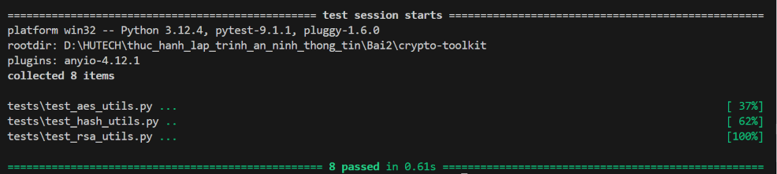
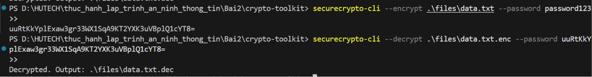
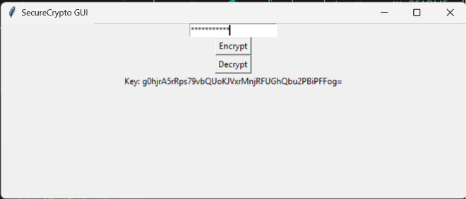
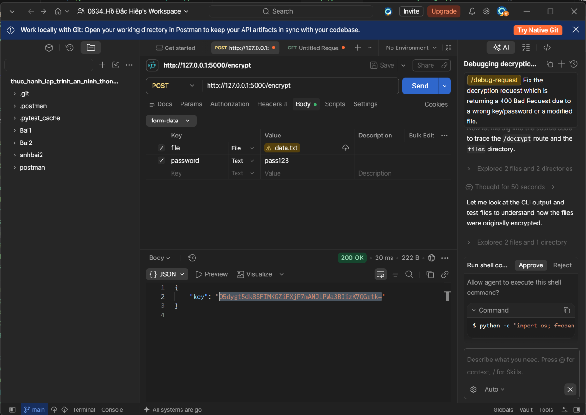
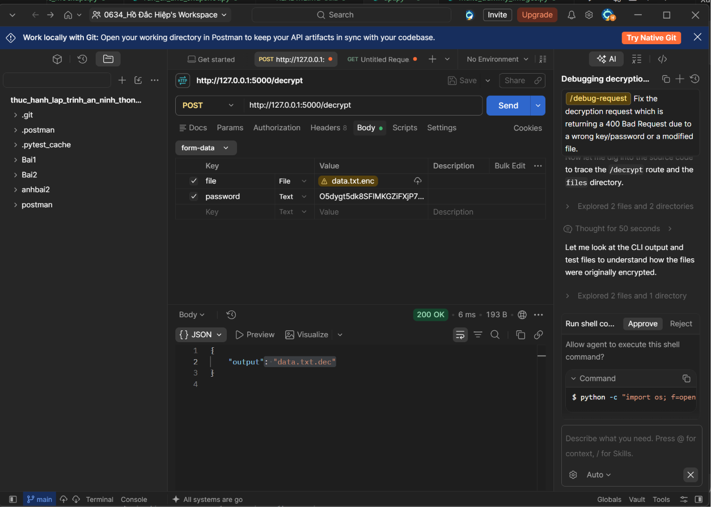
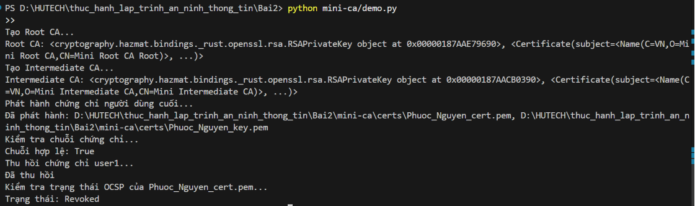
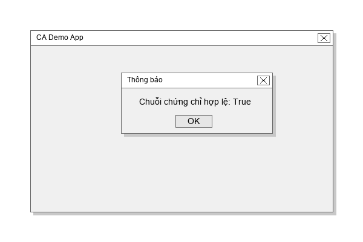

**TRƯỜNG ĐẠI HỌC CÔNG NGHỆ TP HCM**  
**KHOA CÔNG NGHỆ THÔNG TIN**  
**Môn:** An toàn web và cơ sở dữ liệu  

---

# BÁO CÁO TUẦN 02

**Họ Và Tên:** Hồ Đắc Hiệp  
**MSSV:** 2380600634  
**Lớp:** 23DATA1  

---

# Hướng dẫn Kiểm thử Bài 2 (crypto-toolkit & mini-ca)

Thư mục `Bai2` bao gồm hai dự án thành phần liên quan đến an toàn bảo mật và mật mã học:

1. **crypto-toolkit**: Một thư viện/công cụ cung cấp các hàm tiện ích mã hóa đối xứng (AES), bất đối xứng (RSA) và băm (hashing).
2. **mini-ca**: Một Certificate Authority thu nhỏ giúp mô phỏng việc tạo, ký, phát hành và thu hồi chứng chỉ số.

Dưới đây là hướng dẫn chi tiết cách cài đặt môi trường, chạy kiểm thử (test), và xem kết quả.

## Yêu cầu Môi trường
Trước tiên, bạn cần cài đặt các thư viện cần thiết cho cả 2 dự án. Mở terminal (PowerShell hoặc CMD) tại thư mục `Bai2` và chạy lệnh sau:

```powershell
# Cài đặt thư viện cho crypto-toolkit
pip install -r crypto-toolkit/requirements.txt
# Cài đặt chính package để cho phép import
pip install -e ./crypto-toolkit

# Cài đặt thư viện cho mini-ca
pip install -r mini-ca/requirements.txt
```

---

## 1. Kiểm thử `crypto-toolkit`

Dự án này sử dụng `pytest` để chạy các bài unit test đối với các module mã hoá AES, RSA, và Hash. Nó cũng hỗ trợ giao diện CLI, GUI và cung cấp API REST.

### 1.1. Unit Tests với Pytest
Mở terminal, di chuyển vào thư mục `Bai2` và chạy các lệnh sau:
```powershell
cd crypto-toolkit
pytest tests/
```

**Kết quả kiểm thử:**


### 1.2. Kiểm thử CLI (Command Line Interface)
Công cụ hỗ trợ lệnh mã hóa/giải mã từ terminal:
```powershell
python securecrypto/cli.py --encrypt .\files\data.txt --password password123
python securecrypto/cli.py --decrypt .\files\data.txt.enc --password <base64_key>
(Hoặc có thể dùng lệnh `securecrypto-cli` nếu đã install qua setup.py)
```
**Kết quả kiểm thử CLI:**


### 1.3. Kiểm thử GUI Toolkit
Dự án có đi kèm giao diện đồ họa cho người dùng để thao tác trực quan:
```powershell
python securecrypto/app_gui.py
```
**Giao diện minh họa:**


### 1.4. Kiểm thử API qua Postman
Chương trình cung cấp web API (RESTful). Ta có thể test bằng cách dùng Postman để gửi yêu cầu POST đến endpoint `/encrypt` và `/decrypt` (sau khi chạy `python securecrypto/api.py`):

**Smoke Test - Mã hóa (Encrypt):**


**Smoke Test - Giải mã (Decrypt):**


---

## 2. Kiểm thử `mini-ca`

Dự án `mini-ca` cung cấp một demo mô phỏng các hoạt động của một Certificate Authority (CA) trên thực tế. Hiện tại `mini-ca` chưa có các bộ unit test tự động riêng, nhưng có thể test bằng các kịch bản demo chạy tay.

### 2.1. Chạy CLI Demo
Di chuyển vào thư mục `Bai2` và chạy file script `demo.py`:
```powershell
# Bật hiển thị tiếng Việt UTF-8 cho console (trên Windows PowerShell)
$env:PYTHONIOENCODING="utf-8"

python mini-ca/demo.py
```
**Kết quả chạy demo CLI:**


Console in ra mô phỏng chính xác các quy trình chuẩn của hệ thống hạ tầng khoá công khai (PKI):
- Khởi tạo Root CA và Intermediate CA.
- Tạo và phát hành chứng chỉ cho End User.
- Chuỗi chứng chỉ (Certificate Chain) được verify hợp lệ.
- *Ghi chú quan trọng:* Mặc dù output in ra là "Kiểm tra trạng thái OCSP... Trạng thái: Revoked", thực tế mã nguồn đang thực hiện tra cứu số serial bên trong danh sách thu hồi (CRL) cục bộ thay vì triển khai giao thức mạng OCSP thực sự. Trạng thái thu hồi vẫn được kiểm tra đúng (Revoked).

### 2.2. Chạy GUI Demo (mini-ca)
Bạn cũng có thể chạy file giao diện `demo_ui.py` để trải nghiệm tạo CA qua giao diện đồ hoạ trực quan:
```powershell
python mini-ca/demo_ui.py
```
**Giao diện minh họa CA:**


---

> Các ảnh chụp kết quả kiểm thử được lưu trực tiếp tại thư mục `Bai2/images/`.
